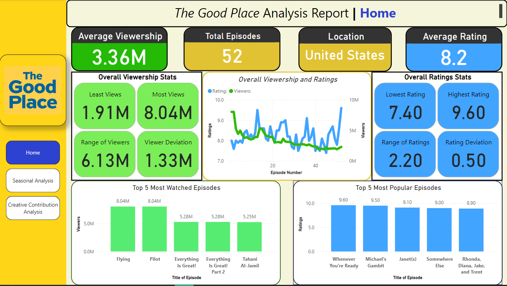

# Hi there, I'm Shavonne Reynolds! 👋

## About Me 🚀

I'm a passionate Data Analyst and Full Stack Developer with experience in Excel, SQL, Power BI, Tableau, Python, JavaScript, HTML, and CSS. I love tackling complex problems, learning new skills, and collaborating with diverse teams to create innovative solutions.

- 🌱 Currently learning: Project development with Node.js
- 🔭 Working on: Coffee Sales Analysis
- 🌍 Languages: SQL, Python, Javascript, HTML, CSS
- 📫 How to reach me: theshavonnereynolds@gmail.com
- ⚡ Fun fact: I love Video Games and Basketball

## My Skills 🧠

## Featured Projects 💻

### [Heritage Foundation of Oswego County Database Website](https://hfdatabase.oswegohistoryrecords.org/)

The **Heritage Foundation of Oswego County Database Website** is a **cloud-based web application** designed to make historical property data in Oswego County accessible to the public. Developed collaboratively within a team of three, **the project leverages front-end development technologies, PHP, and phpMyAdmin** to deliver an intuitive user experience and ensure efficient backend maintenance. You can check out the application [here](https://hfdatabase.oswegohistoryrecords.org/).

### ["The Good Place" Data Analysis](https://github.com/ShavonneReynolds/TheGoodPlace-DataAnalysis)

**The Good Place Data Analysis** is a **data analysis project focused on cleaning, visualizing, and deriving insights from viewership and ratings data for the TV show "The Good Place."** This project was built using **Excel, MySQL, and Power BI.** It showcases my skills in **data cleaning, SQL querying, exploratory data analysis, and data visualization**. 
You can check out the repository [here](https://github.com/ShavonneReynolds/TheGoodPlace-DataAnalysis).

## Get in Touch 📬
- **LinkedIn**: www.linkedin.com/in/theshavonnereynolds
- **Gmail**: theshavonnereynolds@gmail.com

